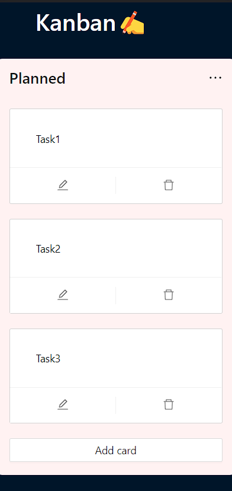

# Krayen | Full Stack Developer Assignment

## Fullstack Code Challenge

Krayen is a technology startup focused on helping DTC brands drive profitable revenue growth using data. We help brands grow & scale through our suite of productivity & analytics applications.

We are a team of designers, programmers, engineers & marketers passionate about Retail 3.0 and the DTC deluge. We’re working with brands from the USA and Europe and are on our path to attain our product market fit.

We are looking to work with people who are passionate about solving real world problems using technology to join our Engineering team.

## How do I complete and submit the assignment?

Fork this repository to start. Raise a pull request for your solution.

Build an excellent READ.ME explaining how to run your code and what libraries you had to choose.begin

Feel free to raise an issue at any time if you have any questions.

## The Task

Build a Kanban board web application. The application should communicate with a Database of your choice(preferebly Postgres) through an API layer.

## Features

1. Must-have

   1. Four default sections - Backlogs, Planned, In Progress and Completed.
   2. One default board and the ability to create multiple boards.
   3. The option to add new tasks to the board, update existing tasks and delete tasks.
   4. The option to drag and drop tasks across the board to change their statuses.

2. Nice to have
   1. The ability to add, update and delete custom sections apart from the default four.

## Suggested Libraries & Frameworks

1. **Frontend**: ReactJS
2. **Backend**: Node + Express
3. **Design system**: ANTD
4. **Database**: Postgres (If you are not familiar with Postgres, feel free to use other databases)

## Duration

The duration to complete this test shall be five days from the date of forking the repository.

# R Varshith Kumar

## To start the project

### Frontend
``` npm i / yarn install```

```npm run dev/ yarn dev```
   
### Backend

```npm  i / yarn install```

```npm run dev/ yarn dev```

Note: Run all the SQL commands in /server/db/db.sql before starting the backend server.

## Screenshots

<br/>

<div align="left" width="100%">
     
</div>

<br/>


<div align="left" width="100%">
     
</div>

<!--  -->
<br/>


<p align="left" width="100%">
     
</p>
